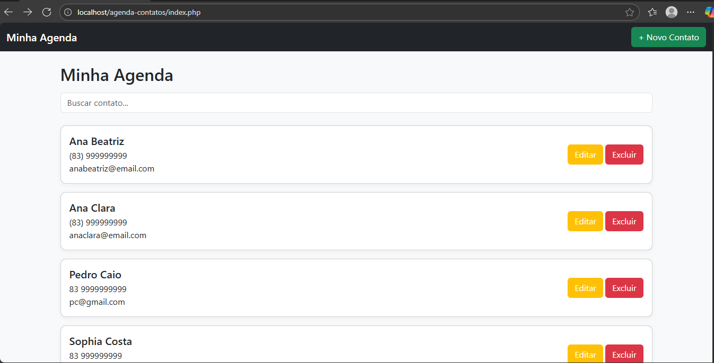

# 📒 Minha Agenda de Contatos

Projeto simples de uma **Agenda de Contatos** desenvolvida com **PHP puro**, **JavaScript puro** e **Bootstrap 5**, sem uso de frameworks.  
O sistema exibe contatos, tem busca dinâmica e interface clean com ícones.

---

## 🚀 Tecnologias usadas

- **PHP** (sem frameworks)
- **JavaScript** (sem frameworks)
- **Bootstrap 5**
- **Bootstrap Icons**
- **HTML & CSS**

---

## 📁 Estrutura do projeto

agenda_simples/
│
├── index.php → Tela principal (lista e busca)
├── adicionar.php → Formulário para adicionar contatos (layout)
├── editar.php → Tela base de edição
├── excluir.php → Tela base de exclusão
│
└── assets/
├── style.css → Estilos extras (tema clean)
└── script.js → Busca dinâmica dos contatos

---

## ✅ Funcionalidades atuais

✔ Listar contatos (fixos no código)  
✔ Buscar contatos em tempo real  
✔ Interface responsiva e clean  
✔ Ícones intuitivos (Bootstrap Icons)  

---

## 👤 Autores

[beatrizdantasp](https://github.com/beatrizdantasp)
 
[acllaras](https://github.com/acllaras)

---

